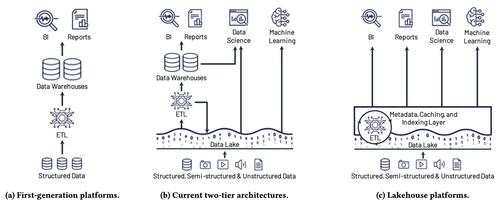

# Midterm Review

### Load Balancing

- DNS load balancing
    - One IP address per server machine
    - Have DNS reorder the list for each client asking for translation of name
    - every client try IP addresses in list order
    - 优点：
        - out of band of actual TCP/HTTP requests
        - can distribute arbitrary bandwidth
    - 缺点：
        - Take a long time to change
        - network middleboxes may cache answer for many clients
- Router distribute TCP connection open packets
    - one IP address → load balancing router
    - spread SYN packets among different server machine
    - 优势
        - router don’t need to remember or think
    - 劣势
        - all traffic must go through router
        - decision is lifetime for entire connection
- Router distribute individual requests
    - one IP address
    - router be endpoint for TCP connection
    - 优势
        - most dynamic approach
    - 劣势
        - requires the most processing and state in the router

### Hadoop MapReduce

- open source implementation of MapReduce
- MapReduce as an analytics engine
- distributed storage layer → HDFS
- Application in MapReduce → jobs
    - each job encompasses several map and reduce tasks
    - Map and reduce tasks operate on data independently and in parallel
- Individual Map and reduce tasks in a MapReduce job are idempotent, and no side effect

> Idempotent: 无论这个操作执行多少次，都会产生同样的结果，即第一次执行后的效果和多次执行后的效果相同
> 
- Node failure: data redundancy through the storage layer (HDFS)
    - Replicates data on other nodes (3 replicas)
- 

### Spark: Optimize MR for iterative apps

- More general: dryad-like graphs of work
- More interactive: Scala interpreter
- More efficient: in-memory

### Resilient Distributed Datasets (RDDs)

- Splits a set into partitions for workers to parallelize operation
- Fault-tolerance through lineage graphs showing how to recompute data
- Transformations and Actions
    - Transformations are lazy (not computed imeediately)
    - transformed RDD gets recomputed when an action is run on it
    - RDD can be persisted into storage in memory or disk

### Stages of Machine Learning

- Data collection
- Model Selection
- Data engineering
- Model training
- Model inferencing

Method 1: MapReduce → it may scale great, but overhead is high

Method 2: Spark → Potential speedup is large

Method 3: Parameter Servers → Less data transmitted and less task overhead

### “Object” (or “blob”) store

- A common option in large clouds
    - A simplified, generic “file” storage system
- Usually limited interface and semantics

### Virtual Disk (VD) implementation

- Client OSs think that they are using a real disk
- VDs often implemented as files
- Thin provisioning
    - Promise more space that you have
- Performance interference

### Distributed filesystems in cloud

- set up long-running instances to be the DFS server

### Row-based storage

- suitable for small tables with frequent single updates
- data for a single row is stored together in one block or page on disk

### Data Lakes

- Large, shared repositories of data
    - “data” includes raw input of various forms, engineered forms, and results
        - Video, audio, text logs, labelled training data, ML models, DBs, etc.
- Enables data processing with nearly any tool desired
    - can read data directly from the data lake and compute on it
    - can write results to the data lake, allowing them to be read by other apps
    - little-to-no overhead fundamentally introduced by the data lake concept
- Big shared collection of files/objects
- Indexes
- Catalog of metadata to discover, understand, and manage data

### Data Warehouse

- System for collecting and managing data from varied sources to provide meaningful business insights.
- System to support query and analysis on historical data derived from transaction data. It usually includes data from other sources.
- Separate analysis workload from transaction workload.
- Consolidate data from several sources

### Star Schema

- A central fact table with keys to one-dimension tables with attributes

### Cloud Data Warehouses (CDW)

- Google BigQuery - fully managed, serverless, utilizes columnar storage and can scale to hundreds of petabytes leveraging standard SQL.
- AWS Redshift - fullu managed, serverless, petabyte-scale data warehouse, save results back to an S3 data lake, federated query unifies analytics, Postgres compatibility.
- Microsoft Azure Synapse Analytics - serverless, distributed, cloud-native, scale-out, relational SQL data warehouse combines data warehouse, data integration, real-time operational analytics.

### Lakehouses

- Separation of compute and storage
- Added a layer for metadata, caching, indexing, & provenance
- Added support for data versioning, access control, and auditing
- Support various APIs for different applications, especially for ML and data science applications
- Mix batch and streaming workloads
- High performance

### Photon - Vectorized Query Engine

- Goals:
    - Performance on “raw uncurated” datasets in data lakes
    - Excellent performance on structured data stored in popular columnar file formats (e.g., Apache Parquet)
- Vectorized-interpreted model instead of code generation.
    - Choose code to execute on data in batches, enable SIMD vectorization
    - Code-generation uses a compiler at runtime to produce query-specialized code
- Photo discovers, maintains, and exploits micro-batch data characteristics with specialized precompiled codepaths
    - Photon runs optimized per-batch code for columnar data

### Tail tolerance techniques

- Design system assuming service time variation is inevitable
- “hedged” requests (or “speculative” redundant requests)
    - ask more than one server to do the work
    - take the first response
    - great for hiding infrequent slow responses, especially if 2nd request is delayed
- “tied” requests (aggressive hedging with cancelation)
    - ask more than one server immediately, but let them know you did
    - when one finishes (or starts), it “cancels” the other/redundant request
    - address infrequent slow responses faster with less redundant work
- “micro-partitioning”: migrate (replicate?) 5% of partitions when imbalanced
- “probation”: elimination of slow nodes from datapath until their specs get better
- some apps offer special opportunities or challenges
    - large information-retrieval (IR) apps such as “fuzzy” search
- Positive ex: an IR service can answer without all leaves’ responses
    - Why: a query displaying most of the possible answers is usually “good enough”
    - So, just return what is available within acceptable time limit
- Negative ex: some queries can sometimes cause deterministic failure
    - e.g. bugs in the system triggered by specific queries
    - Executing same query on all leaves causes “soft crash” outage latencies
    - “Canary requests” (金丝雀请求) are one or two internal queries sent first to test the waters
        - If these crash, system can survive and the remaining servers are not queried
    - [Dean13] claims benefit of avoiding crashes worth extra round of latency

### Common Geo-Replicated Storage Goals

- Serve client requests quickly
- Scale out nodes/datacenters
- Interact with data coherently

### CAP Theorem

- Eric Brewer, 1998
- Consistency, Availability, and Partition tolerance 无法三者同时满足
- Lynch/Gilbert 2002 proved the extreme case
- Reality is that partition is rare, but during partition you have to pick between consistency (stop & wait) or availability (access stale data)

### ALPS Properties

- Many systems today provide “ALPS Properties”
- Availability
- Low latency = O(Local RTT)
- Partition Tolerance
- Scalability
- Each replica “independent”
- Any request can be serviced by any data center
    - read or write
    - no coordination with other data centers to service requests
- Updates propagated to other data centers in the background
    - essentially, updates are logged and streamed to other sites
        - may be done update-by-update or as atomic batches
    - often via protocol that ensures “eventual consistency”
        - no guarantees on when

### ALPS-oriented Geo-Replicated Storage Achieves

- Serve client requests quickly
- Scale out nodes/datacenter

But, often users would like to interact with data coherently

- Stronger consistency
- Stronger semantics

### What is “Consistency”

- Guarantees on the shared view across the system
    - For example, which writes is a reader guaranteed to see?
- Ensuring consistency involves restricting order/timing of operations
- Stronger consistency…
    - Makes application programming easier
    - Makes user experience better

### Strong Consistency: Linearizability

- [Herlihy Wing ‘90]
- Ensures a total order of operations
- The order agrees with “real time”
- So, West coast reads would see East coast writes

### Consistency options with ALPS

- Linearizability → Nope: Impossible
- Serializability → Nope: Impossible
- Causal
- “Eventual”

### Causal Consistency vs. Eventual Consistency

- Causal Consistency requires all values returned by reads to be consistent with all potential causality relationships (partial ordering)
    - Note that no potential causality means logically concurrent
    - Conflicts are logically concurrent operations where ordering matters
        - Writes to replicas without a message path between them
    - Conflicts resolution must be deterministic (later observer sees same result)
        - E.g., “last writer wins”, or fenced for user resolution (Coda)
- Eventual consistency does not strive to maximize potential causality